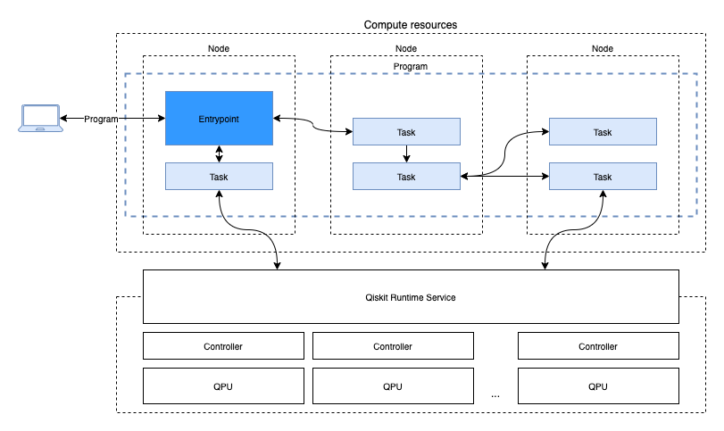

[](https://github.com/Qiskit/qiskit-serverless/releases)
[](https://github.com/qiskit-community/quantum-prototype-template/blob/main/LICENSE.txt)
[](https://github.com/psf/black)
[](https://www.python.org/)
[](https://github.com/Qiskit/qiskit)

# Qiskit Serverless

Qiskit Serverless is a user-friendly tool that enables you to easily run complex quantum computing tasks.
With this software, you can execute Qiskit Functions as long running jobs and distribute them across multiple CPUs, GPUs, and QPUs.
This means you can take on more complex quantum-classical programs and run them with ease.
You don't have to worry about configuration or scaling up computational resources, as Qiskit Serverless takes care of everything for you.



### Table of Contents

1. [Quickstart](#quickstart)
   1. [Using Docker](#docker)
   1. [Using Kubernetes](#kubernetes)
1. Modules
   1. [Client](./client)
   1. [Gateway](./gateway)
   1. [Charts](./charts)
1. [How to Give Feedback](#how-to-give-feedback)
1. [Contribution Guidelines](#contribution-guidelines)
1. [Deprecation Policy](#deprecation-policy)
1. [References and Acknowledgements](#references-and-acknowledgements)
1. [License](#license)

----------------------------------------------------------------------------------------------------

### Quickstart
This Quickstart section guides users to easily deploy Qiskit Serverless infrastructure and run a simple example.

#### Docker
For user convenience, this section assumes that users will deploy the infrastructure in a local environment using Docker following the next steps.

1. Prepare local Qiskit Serverless infrastructure
   1. Install Docker
      You can use any runtime that you prefer to run Docker on your machine: Docker Desktop, podman... If you are using a MacOS with ARM processors we highly recommend to use [Colima](https://github.com/abiosoft/colima) as your container runtime to avoid problems with that architecture.

      This is a project that takes advantage of distributed computing, so it places a high demand on resources. We recommend increasing the assigned resources to these runtimes. In case of Colima for example we typically use:
      ```shell
      colima start --cpu 4 --memory 8 --disk 100
      ```
   1. Install qiskit-serverless on your local system (we recommend using a [virtual environment](https://docs.python.org/3/library/venv.html)).
      ```shell
      pip install qiskit-serverless
      ```
   1. Clone the Qiskit Serverless repository
      ```shell
      git clone https://github.com/Qiskit/qiskit-serverless.git
      ```
   1. Run Qiskit Serverless infrastructure
      Execute Docker Compose using the following commands.
      ```shell
      cd qiskit-serverless/
      sudo docker compose up
      ```

      The output should resemble the following.
      ```
      ~/qiskit-serverless$ sudo docker compose --profile jupyter up
      [+] Running 5/0
       ✔ Network public-qiskit-serverless_safe-tier     Created                                           0.0s
       ✔ Container ray-head                              Created                                           0.0s
       ✔ Container public-qiskit-serverless-postgres-1  Created                                           0.0s
       ✔ Container gateway                               Created                                           0.0s
       ✔ Container scheduler                             Created                                           0.0s
      Attaching to gateway, public-qiskit-serverless-postgres-1, ray-head, scheduler
      ```
1. Write your first Qiskit Function following our hello-world example in the [tutorial section](https://qiskit.github.io/qiskit-serverless/getting_started/basic/01_running_program.html).

   That's all!

#### Kubernetes
For user convenience, this section assumes that users will deploy the infrastructure in a local environment using Kind following the next steps.

1. Prepare local Qiskit Serverless infrastructure
   1. Install Docker
      You can use any runtime that you prefer to run Docker on your machine: Docker Desktop, podman... If you are using a MacOS with ARM processors we highly recommend to use [Colima](https://github.com/abiosoft/colima) as your container runtime to avoid problems with that architecture.

      This is a project that takes advantage of distributed computing, so it places a high demand on resources. We recommend increasing the assigned resources to these runtimes. In case of Colima for example we typically use:
      ```shell
      colima start --cpu 4 --memory 8 --disk 100
      ```
   1. Install Kind
      To simplify the process to deploy a k8s cluster locally we use [Kind](https://kind.sigs.k8s.io/docs/user/quick-start#installation) as the main tool to create a cluster.
   1. Install qiskit-serverless on your local system (we recommend using a [virtual environment](https://docs.python.org/3/library/venv.html)).
      ```shell
      pip install qiskit-serverless
      ```
   1. Clone the Qiskit Serverless repository
      ```shell
      git clone https://github.com/Qiskit/qiskit-serverless.git
      ```
   1. Run Qiskit Serverless infrastructure
      Execute the script to setup the cluster
      ```shell
      tox -e cluster-deploy
      ```
      The creation process can take some minutes.
1. Write your first Qiskit Function following our hello-world example in the [tutorial section](https://qiskit.github.io/qiskit-serverless/getting_started/basic/01_running_program.html).

   That's all!

For more detailed examples and explanations refer to the [Guide](https://qiskit.github.io/qiskit-serverless/index.html):

1. [Getting Started](https://qiskit.github.io/qiskit-serverless/getting_started/index.html#)
1. [Example Qiskit Functions](https://qiskit.github.io/qiskit-serverless/examples/index.html)
1. [Infrastructure](https://qiskit.github.io/qiskit-serverless/deployment/index.html)
1. [Migrating from Qiskit Runtime programs](https://qiskit.github.io/qiskit-serverless/migration/index.html)

----------------------------------------------------------------------------------------------------

### How to Give Feedback

We encourage your feedback! You can share your thoughts with us by:
- Opening an [issue](https://github.com/Qiskit/qiskit-serverless/issues) in the repository


----------------------------------------------------------------------------------------------------

### Contribution Guidelines

For information on how to contribute to this project, please take a look at our [contribution guidelines](CONTRIBUTING.md).

----------------------------------------------------------------------------------------------------

### Deprecation Policy

This project is meant to evolve rapidly and, as such, do not follow [Qiskit's deprecation policy](https://github.com/Qiskit/qiskit/blob/main/DEPRECATION.md).  We may occasionally make breaking changes in order to improve the user experience.  When possible, we will keep old interfaces and mark them as deprecated, as long as they can co-exist with the new ones.  Each substantial improvement, breaking change, or deprecation will be documented in release notes.


----------------------------------------------------------------------------------------------------

## References and Acknowledgements
[1] Qiskit \
    https://github.com/Qiskit/qiskit

[2] Client for IBM Qiskit Runtime \
    https://github.com/Qiskit/qiskit-ibm-runtime


----------------------------------------------------------------------------------------------------

### License
[Apache License 2.0](LICENSE.txt)
